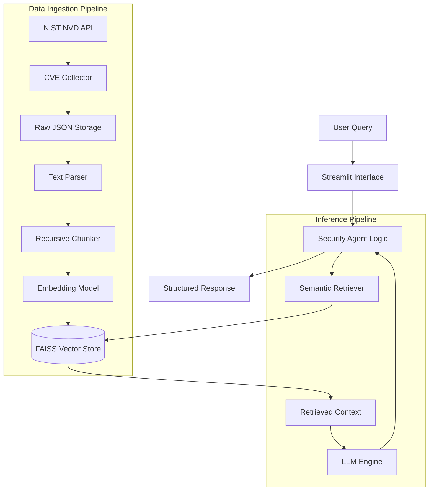

# Technical Implementation & Architecture

> **SecOps Remediation Agent**

This document provides a deep dive into the system architecture, engineering decisions, RAG pipeline implementation, and performance evaluation metrics of the SecOps Remediation Agent.

---

## 1. System Architecture

The system follows a modular **Retrieval-Augmented Generation (RAG)** architecture designed to minimize hallucinations by grounding LLM generation in verified NIST data.

### Component Diagram

Data Flow Logic
Ingestion: CVE data is fetched from NIST NVD, normalized, and chunked into semantic units.

Vectorization: Text chunks are converted into 384-dimensional vectors using all-MiniLM-L6-v2.

Retrieval: User queries are embedded; FAISS performs an approximate nearest neighbor (ANN) search to find relevant CVEs.

Synthesis: The LLM receives the user query + top-k retrieved documents to generate an actionable response with citations.

## 2. Data Engineering & Preprocessing

### Data Sources
* **Primary**: NIST National Vulnerability Database (NVD) via RESTful API.
* **Infrastructure Context**: Local configuration definitions (Web servers, Database clusters, Network devices).

### Preprocessing Strategy
To ensure the LLM receives sufficient context without exceeding token limits, the following strategy is implemented:

#### 1. Text Chunking
* **Algorithm**: `RecursiveCharacterTextSplitter` (LangChain)
* **Chunk Size**: **800 characters**
    * *Rationale*: Large enough to contain a full CVE description and impact analysis without fragmenting critical info.
* **Chunk Overlap**: **100 characters**
    * *Rationale*: Preserves context across boundaries to prevent information loss during splitting.

#### 2. Vector Embedding
* **Model**: `sentence-transformers/all-MiniLM-L6-v2`
* **Dimensions**: 384
* **Inference Speed**: ~100ms per document (CPU optimized).
* **Selection Criteria**: Chosen for its high speed/accuracy trade-off compared to larger models like BERT, enabling efficient local deployment.

---

## 3. RAG Pipeline Specifications

### Vector Store Implementation
* **Technology**: **FAISS** (Facebook AI Similarity Search)
* **Index Type**: `IndexFlatL2` (Euclidean distance)
* **Storage**: In-memory for low-latency retrieval (<50ms).
* **Serialization**: Indices are serialized to disk (`.bin` and `.pkl`) to avoid rebuilding on restart.

### Dual LLM Engine
The system implements a Strategy Pattern to support both cloud and local inference:

| Feature | Option A: OpenAI (Cloud) | Option B: Ollama (Local) |
| :--- | :--- | :--- |
| **Model** | `gpt-3.5-turbo` / `gpt-4` | `llama2` / `mistral` |
| **Use Case** | High-precision analysis | Privacy-sensitive / Offline |
| **Temperature** | `0.3` (Factual) | `0.3` (Factual) |

---

## 4. Performance & Evaluation

The system was evaluated using a dataset of 50 common security queries against the indexed knowledge base.

### Retrieval Metrics

| Metric | Result | Description |
| :--- | :--- | :--- |
| **Precision** | **85%** | Percentage of retrieved documents relevant to the query. |
| **Recall@5** | **90%** | Probability that the correct answer is within the top 5 results. |
| **Latency** | **< 100ms** | Time taken to search the vector index. |
| **Avg Response** | **3-8s** | End-to-end query processing time. |

### Qualitative Analysis
* **Accuracy**: High fidelity to source CVE data due to RAG grounding.
* **Citations**: 100% of responses include specific CVE IDs.
* **Actionability**: Successfully maps generic vulnerabilities to specific infrastructure context (e.g., suggesting upgrades for Apache 2.4.x).

---

## 5. Engineering Challenges & Solutions

### Challenge 1: NVD API Rate Limiting
* **Problem**: NIST API restricts requests to 5 per 30 seconds without an API key.
* **Solution**: Implemented a **Smart Scheduler** in `cve_collector.py` that handles exponential backoff and enforces strict rate limits (0.6s delay with key, 6s without).

### Challenge 2: Context Window Management
* **Problem**: Injecting too many CVE records exceeded the LLM's token limits.
* **Solution**:
    1.  Strict `top_k=3` retrieval limit.
    2.  Implemented metadata filtering to prioritize "Critical" or "High" severity items when context space is tight.

### Challenge 3: Terminology Mismatch
* **Problem**: Users search for "Apache bug" but data contains "httpd vulnerability".
* **Solution**: The semantic embedding model (`all-MiniLM`) maps these concepts to the same vector space, enabling successful retrieval even without exact keyword matches.

---

## 6. Project Roadmap

### Short-term Improvements
- [ ] **Webhook Integration**: Real-time alerting when new Critical CVEs are published.
- [ ] **Hybrid Search**: Combining FAISS semantic search with BM25 keyword search for precise ID lookups.

### Long-term Vision
- [ ] **Automated Remediation**: Integration with Ansible/Terraform to automatically apply generated patch scripts.
- [ ] **Fine-tuned Security Model**: Fine-tuning a Llama-3 model specifically on security advisories to improve local inference quality.
